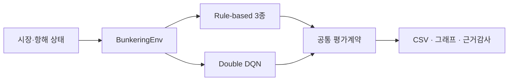
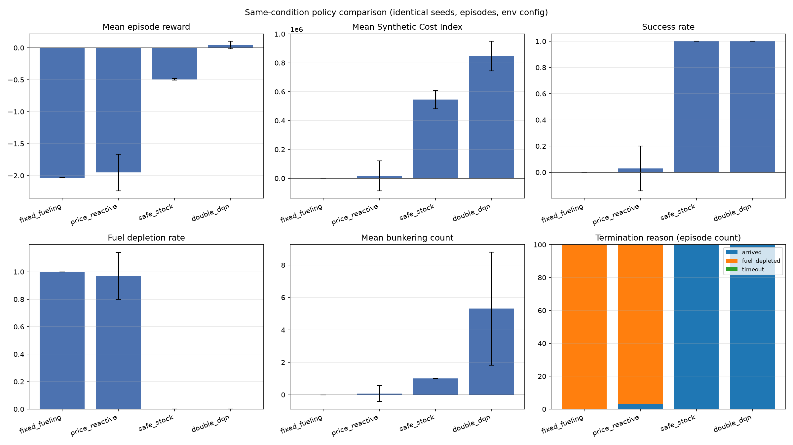

<div align="center">

# 병커시유 | Bunkering-AI

### 항해 상태를 고려한 선박 벙커시유 의사결정 실험 플랫폼


<br>


가격·환율·연료잔량·잔여항로를 함께 고려하고,  
Rule-based 3종과 Double DQN을 동일한 평가계약으로 비교합니다.

[공식 평가](#공식-동일조건-평가) · [공공데이터](#공공데이터-활용) · [재현 방법](#빠른-시작) · [기술문서](#문서-안내) · [Release](https://github.com/heechan9/bunkering-ai/releases/tag/official-eval-2026-09-01)

</div>

---

## 프로젝트 개요

병커시유는 선박의 순차 급유 의사결정을 실험하기 위한 강화학습 프로젝트입니다. 합성 항해 환경에서 가격·환율과 운항 상태를 함께 관측하고, 규칙 기반 정책과 학습 정책을 재현 가능한 조건으로 평가합니다.

- **환경**: Gymnasium 기반 `BunkeringEnv`
- **비교 정책**: Fixed Fueling, Price Reactive, Safe Stock, Double DQN
- **평가 계약**: 동일한 seed·episode·환경설정과 공통 결과 스키마
- **근거 관리**: canonical CSV·JSON, 체크포인트 해시, 논문 근거감사
- **도메인 참고**: 울산항만공사 벙커링정박지 신청현황 6,028건



## 공식 동일조건 평가

Rule-based 3종과 Double DQN의 **공식 동일조건 성능비교를 수행했으며**, 정본은
[`results/evaluation_results.csv`](results/evaluation_results.csv)와
[`results/evaluation_manifest.json`](results/evaluation_manifest.json)입니다.

| 정책 | 평균 Reward | Synthetic Cost Index | 성공률 | 연료고갈률 | 평균 급유횟수 |
|---|---:|---:|---:|---:|---:|
| Fixed Fueling | -2.030 | 0 | 0% | 100% | 0.00 |
| Price Reactive | -1.952 | 17,370 | 3% | 97% | 0.08 |
| Safe Stock | -0.493 | 545,393 | 100% | 0% | 1.00 |
| Double DQN | 0.044 | 847,118 | 100% | 0% | 5.31 |



> **해석 범위**  
> 위 결과는 학습 seed 42로 한 번 학습한 단일 모델을 평가 seed 42~141의 100개 에피소드에서 검증한 값입니다. 표준편차는 학습 반복 간 분산이 아니라 평가 에피소드 간 분산입니다. Double DQN은 평균 reward가 높지만 Safe Stock보다 Synthetic Cost Index와 급유횟수도 높으므로, 전체적인 우수성을 주장하지 않습니다.

공식 체크포인트 `dqn_final.pt`는 [GitHub Release](https://github.com/heechan9/bunkering-ai/releases/tag/official-eval-2026-09-01)에 보존되어 있습니다.

- SHA-256: `970aafbf2d32e9bef558a5611a300cd0885f826af2c872a83119a6e9fcbcf392`
- 상세 조건과 검증 절차: [공식 평가 문서](docs/technical/official_evaluation.md)

## 공공데이터 활용

공공데이터포털의 울산항만공사 `벙커링정박지 신청현황` 6,028건을 분석하여 총톤수·벙커량·예정 시작일·종료일 등 실제 업무변수의 구조와 분포를 확인했습니다.

공공데이터를 DQN 학습 입력이나 공식 성능평가 데이터로 사용하지 않았으며, 실시간 API 연동도 아직 구현하지 않았습니다. 해당 분석은 향후 시나리오 설계와 실증 범위를 검토하기 위한 **도메인 참고자료**입니다.

| 확인 항목 | 저장소 근거 |
|---|---|
| 원자료·출처·해시 | [데이터 설명서](docs/data/upa_bunkering_anchorage.md) |
| 재현 가능한 분석 | [분석 스크립트](scripts/analyze_upa_public_data.py) |
| 기초통계·품질검사 | [공공데이터 결과](results/public_data/) |
| 보고서 반영 범위 | [보고서 업데이트 가이드](docs/submission/public_data_report_updates.md) |

## 빠른 시작

```bash
pip install -r requirements.txt

# Rule-based 기준선
python scripts/baseline.py

# Double DQN 학습
python scripts/train.py --seed 42 --checkpoint checkpoints/dqn_final.pt

# 저장 체크포인트 독립 평가
python scripts/evaluate.py --episodes 100 --seed 42 --checkpoint checkpoints/dqn_final.pt

# 전체 검증
pytest tests -q
python -m scripts.audit_paper_evidence
```

`scripts/evaluate.py`는 학습 없이 체크포인트를 불러와 네 정책을 동일한 seed·episode·환경설정에서 greedy 평가합니다.

## 저장소 구성

| 경로 | 역할 |
|---|---|
| `agents/` | Double DQN 에이전트와 신경망 |
| `envs/` | Gymnasium 기반 `BunkeringEnv` |
| `configs/` | 학습 하이퍼파라미터 |
| `evaluation/` | 공통 평가계약과 논문 근거감사 |
| `scripts/` | 기준선·학습·평가·데이터 분석 CLI |
| `data/public/` | 출처와 해시를 기록한 공공데이터 |
| `results/evaluation/` | 공식 동일조건 평가 요약과 시각화 |
| `tests/` | 환경·에이전트·평가·데이터 검증 |

## 문서 안내

| 문서 | 내용 |
|---|---|
| [상태·행동·보상 명세](docs/technical/state_action_reward_spec.md) | 환경 계약과 주장 경계 |
| [공통 평가계약](docs/technical/evaluation_contract.md) | 정책 간 공정 비교 기준 |
| [공식 평가](docs/technical/official_evaluation.md) | 실행 조건·산출물·체크포인트 검증 |
| [논문 근거감사](docs/technical/paper_evidence_audit.md) | 문서·코드·정본 근거 일관성 검사 |
| [운항 검증 로드맵](docs/technical/causal_operational_validation.md) | 합성환경과 실제 운항 효과의 구분 |
| [직무 연계 가이드](docs/ROLE_ALIGNMENT.md) | 구현 증거·직무 연결·주장 한계 |
| [기여 정책](CONTRIBUTIONS.md) | 사람·AI 협업 역할과 검증 원칙 |

## 현재 한계

- 공식 결과는 합성환경 평가이며 실제 운항 성능을 의미하지 않습니다.
- 실제 유가·환율의 실시간 연동은 구현 범위 밖입니다.
- 항만 1·2·3의 가격·대기시간·수수료는 아직 차등화하지 않았습니다.
- 공식 비교는 단일 학습 seed 모델 기준이며 다중 학습 seed 검증이 필요합니다.
- Synthetic Cost Index는 실제 통화 비용이 아닌 합성환경 내부 지표입니다.

---

<div align="center">

**재현 가능한 평가와 과장 없는 근거 관리를 우선합니다.**

</div>
