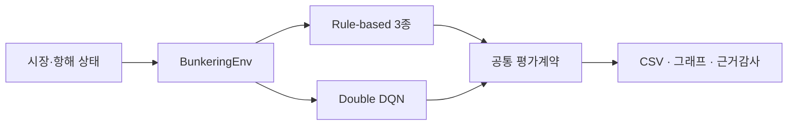

<div align="center">

# 병커시유 | Bunkering-AI

### 항해 상태를 고려한 선박 벙커시유 의사결정 실험 플랫폼


<br>


가격·환율·연료잔량·잔여항로를 함께 고려하고,  
Rule-based 3종과 Double DQN을 동일한 평가계약으로 비교합니다.

[공식 평가](docs/technical/official_evaluation.md) · [공공데이터](docs/data/upa_bunkering_anchorage.md) · [재현 방법](docs/technical/evaluation_contract.md) · [기술문서](docs/technical/state_action_reward_spec.md) · [Release](https://github.com/heechan9/bunkering-ai/releases/tag/official-eval-2026-09-01)

</div>

---

## 30초 요약

> **한 문장으로:** 선박의 시장·항해 상태를 바탕으로 급유 시점을 결정하는 여러 전략을 같은 가상 항해 조건에서 비교하고, 결과의 근거까지 다시 확인할 수 있게 만든 프로젝트입니다.

선박은 항해 중 연료가 떨어지면 안 되지만, 필요 이상으로 자주 급유하면 비용이 커질 수 있습니다. 병커시유는 **현재 가격·환율·남은 연료·남은 항로를 보고 지금 급유할지 기다릴지를 실험하는 시스템**입니다.

- 단순한 의사결정 규칙 3개와 강화학습 AI를 같은 가상 항해 조건에서 비교했습니다.
- 네 개 정책 모두 같은 난수 조건과 평가 횟수를 적용해 공정하게 검증했습니다.
- 울산항만공사 공공데이터 6,028건은 현장 변수와 분포를 이해하는 참고자료로만 사용했습니다.
- 이번 실험에서는 AI의 보상이 가장 높았지만, 안전재고 정책보다 급유 횟수와 합성비용도 높아 **AI가 무조건 우수하다고 결론 내리지 않았습니다.**

## 한눈에 보는 작동 방식

<div align="center">


</div>

1. **현재 상황을 확인합니다.** 유가·환율·연료잔량·잔여항로·연료소비율 등 시장과 항해 상태를 입력으로 사용합니다.
2. **급유 전략을 비교합니다.** 세 가지 규칙 기반 정책과 Double DQN이 같은 가상 항해 조건에서 급유 여부와 행동을 결정합니다.
3. **항해 결과를 함께 평가합니다.** 목적지 도착, 연료고갈, 보상, 급유횟수와 합성비용을 기록해 안전성과 비용의 장단점을 확인합니다.

> 이 그림은 시스템의 개념적 흐름을 설명하기 위한 시각화입니다. 실제 선박을 자동 제어하거나 실시간 항만 운영시스템과 연동한 화면이 아닙니다.

## 연구 질문과 검증 설계

이 저장소는 다음 세 질문에 답하도록 구성했습니다.

1. **안전하게 목적지에 도달하는가?** 성공률과 연료고갈률로 확인합니다.
2. **같은 조건에서 정책별 차이가 재현되는가?** 동일 seed·episode·환경설정과 공통 출력 형식을 적용합니다.
3. **높은 보상이 곧 운영상 우수함을 뜻하는가?** 급유횟수와 Synthetic Cost Index를 함께 보고 상충관계를 해석합니다.

병커시유는 선박의 순차 급유 의사결정을 실험하기 위한 강화학습 프로젝트입니다. 합성 항해 환경에서 가격·환율과 운항 상태를 함께 관측하고, 규칙 기반 정책과 학습 정책을 재현 가능한 조건으로 평가합니다.

- **실험 환경**: 선박 상태와 시장 조건을 재현한 Gymnasium 기반 `BunkeringEnv`
- **비교 정책**: 고정 급유, 가격 반응형, 안전재고, Double DQN 학습 정책
- **공정한 비교**: 동일한 난수 조건(seed)·평가 횟수(episode)·환경설정과 공통 결과 형식
- **근거 관리**: 공식 CSV·JSON, 체크포인트 해시, 논문 근거감사
- **현장 참고자료**: 울산항만공사 벙커링정박지 신청현황 6,028건



## 검증한 내용과 근거

| 문제와 판단 | 수행 내용 | 확인 가능한 근거 | 실무 연결 |
|---|---|---|---|
| 강화학습 정책만 제시하면 우수성을 공정하게 판단하기 어렵다고 정의 | 규칙 기반 3종과 Double DQN에 동일 seed·episode·환경설정을 적용 | 공통 평가계약, 공식 CSV·JSON, 체크포인트 해시 | 알고리즘 비교평가·재현 가능한 실험 설계 |
| 높은 보상만으로 운영상 우수하다고 결론 내리지 않음 | 성공률·연료고갈률·급유횟수·합성비용을 함께 비교 | 100회 가상 항해 공식 평가, 근거감사 8/8 | 안전·비용·성능의 다목적 의사결정 |
| 실험 데이터와 현장 참고자료의 역할을 구분 | 공공데이터는 업무변수 이해에 사용하고 DQN 성능 근거에서는 제외 | 데이터 설명서·해시·분석 스크립트 | 데이터 거버넌스·주장 범위 관리 |

> **최희찬의 역할:** 프로젝트 리드로서 문제와 요구사항, State·Action·Reward 및 KPI 방향, 실험 우선순위를 정하고 결과 검토·문서 통합·저장소 운영을 담당했습니다. 구현·검증의 세부 기여는 [기여 정책](CONTRIBUTIONS.md)에 구분해 기록합니다.

## 공식 동일조건 평가

### 실험 결과: 무엇이 나왔나

- **Safe Stock(안전재고)**: 항해 성공률 100%, 평균 급유 1회로 안정적인 결과를 보였습니다.
- **Double DQN(학습 정책)**: 항해 성공률 100%와 가장 높은 평균 보상을 기록했지만, 평균 급유횟수와 Synthetic Cost Index도 가장 높았습니다.
- **Fixed Fueling·Price Reactive**: 현재 설정에서는 연료고갈률이 높아 안정적인 항해 전략으로 보기 어려웠습니다.
Rule-based 3종과 Double DQN의 **공식 동일조건 성능비교를 수행했으며**, 정본은
[`results/evaluation_results.csv`](results/evaluation_results.csv)와
[`results/evaluation_manifest.json`](results/evaluation_manifest.json)입니다.

| 정책 | 평균 Reward | Synthetic Cost Index | 성공률 | 연료고갈률 | 평균 급유횟수 |
|---|---:|---:|---:|---:|---:|
| Fixed Fueling (고정 급유) | -2.030 | 0 | 0% | 100% | 0.00 |
| Price Reactive (가격 반응형) | -1.952 | 17,370 | 3% | 97% | 0.08 |
| Safe Stock (안전재고) | -0.493 | 545,393 | 100% | 0% | 1.00 |
| Double DQN (학습 정책) | 0.044 | 847,118 | 100% | 0% | 5.31 |


### 결과 해석: 무엇을 의미하나

Double DQN은 이 보상설계에서 가장 높은 평균 reward를 보였지만, Safe Stock보다 더 자주 급유했고 Synthetic Cost Index도 높았습니다. 따라서 이 결과는 학습 정책의 보편적 우월성을 뜻하지 않으며, **정책마다 안전성·보상·비용·운용 복잡도 사이의 선택이 달라진다**는 근거로 해석합니다.

> **정확한 해석 범위**  
> 위 결과는 난수 조건(seed) 42로 한 번 학습한 단일 모델을, 평가 난수 조건 42~141의 가상 항해 100회(episode)에서 검증한 값입니다. 표준편차는 여러 번 다시 학습했을 때의 차이가 아니라 평가 항해별 차이를 나타냅니다. Double DQN은 평균 reward가 높지만 Safe Stock보다 Synthetic Cost Index와 급유횟수도 높으므로, 전체적인 우수성을 주장하지 않습니다.

공식 체크포인트 `dqn_final.pt`는 [GitHub Release](https://github.com/heechan9/bunkering-ai/releases/tag/official-eval-2026-09-01)에 보존되어 있습니다.

- SHA-256: `970aafbf2d32e9bef558a5611a300cd0885f826af2c872a83119a6e9fcbcf392`
- 상세 조건과 검증 절차: [공식 평가 문서](docs/technical/official_evaluation.md)

Rule-based 3종은 별도 하네스로 seed 200개까지 확장한 독립 강건성 검증을 따로 두었습니다([문서](docs/technical/rulebased_robustness.md)). 위 공식 100-seed 결과를 대체하지 않는 부록이며, 겹치는 100개 seed에서 두 결과는 에피소드 단위로 완전히 일치합니다.

## 공공데이터 활용

공공데이터포털의 울산항만공사 `벙커링정박지 신청현황` 6,028건을 분석하여 총톤수·벙커량·예정 시작일·종료일 등 실제 업무변수의 구조와 분포를 확인했습니다.

공공데이터를 DQN 학습 입력이나 공식 성능평가 데이터로 사용하지 않았으며, 실시간 API 연동도 아직 구현하지 않았습니다. 해당 분석은 향후 시나리오 설계와 실증 범위를 검토하기 위한 **도메인 참고자료**입니다.

| 확인 항목 | 저장소 근거 |
|---|---|
| 원자료·출처·해시 | [데이터 설명서](docs/data/upa_bunkering_anchorage.md) |
| 재현 가능한 분석 | [분석 스크립트](scripts/analyze_upa_public_data.py) |
| 기초통계·품질검사 | [공공데이터 결과](results/public_data/) |
| 보고서 반영 범위 | [보고서 업데이트 가이드](docs/submission/public_data_report_updates.md) |

## 빠른 시작

```bash
pip install -r requirements.txt

# Rule-based 기준선
python scripts/baseline.py

# Double DQN 학습
python scripts/train.py --seed 42 --checkpoint checkpoints/dqn_final.pt

# 저장 체크포인트 독립 평가
python scripts/evaluate.py --episodes 100 --seed 42 --checkpoint checkpoints/dqn_final.pt

# 전체 검증
pytest tests -q
python -m scripts.audit_paper_evidence
```

`scripts/evaluate.py`는 학습 없이 저장된 AI 모델(checkpoint)을 불러와 네 개 정책을 동일한 난수 조건(seed)·평가 횟수(episode)·환경설정에서 평가합니다.

## 저장소 구성

| 경로 | 역할 |
|---|---|
| `agents/` | Double DQN 에이전트와 신경망 |
| `envs/` | Gymnasium 기반 `BunkeringEnv` |
| `configs/` | 학습 하이퍼파라미터 |
| `evaluation/` | 공통 평가계약과 논문 근거감사 |
| `scripts/` | 기준선·학습·평가·데이터 분석 CLI |
| `data/public/` | 출처와 해시를 기록한 공공데이터 |
| `results/evaluation/` | 공식 동일조건 평가 요약과 시각화 |
| `tests/` | 환경·에이전트·평가·데이터 검증 |

## 문서 안내

| 문서 | 내용 |
|---|---|
| [상태·행동·보상 명세](docs/technical/state_action_reward_spec.md) | 환경 계약과 주장 경계 |
| [공통 평가계약](docs/technical/evaluation_contract.md) | 정책 간 공정 비교 기준 |
| [공식 평가](docs/technical/official_evaluation.md) | 실행 조건·산출물·체크포인트 검증 |
| [논문 근거감사](docs/technical/paper_evidence_audit.md) | 문서·코드·정본 근거 일관성 검사 |
| [Rule-based 강건성 검증](docs/technical/rulebased_robustness.md) | 공식 결과와 분리된 200-seed 독립 재현 |
| [운항 검증 로드맵](docs/technical/causal_operational_validation.md) | 합성환경과 실제 운항 효과의 구분 |
| [직무 연계 가이드](docs/ROLE_ALIGNMENT.md) | 구현 증거·직무 연결·주장 한계 |
| [기여 정책](CONTRIBUTIONS.md) | 사람·AI 협업 역할과 검증 원칙 |

## 현재 한계

- 공식 결과는 합성환경 평가이며 실제 운항 성능을 의미하지 않습니다.
- 실제 유가·환율의 실시간 연동은 구현 범위 밖입니다.
- 항만 1·2·3의 가격·대기시간·수수료는 아직 차등화하지 않았습니다.
- 공식 비교는 단일 학습 seed 모델 기준이며 다중 학습 seed 검증이 필요합니다.
- Synthetic Cost Index는 실제 통화 비용이 아닌 합성환경 내부 지표입니다.

---

<div align="center">

**재현 가능한 평가와 과장 없는 근거 관리를 우선합니다.**

</div>
