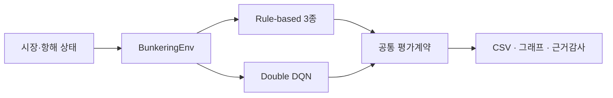
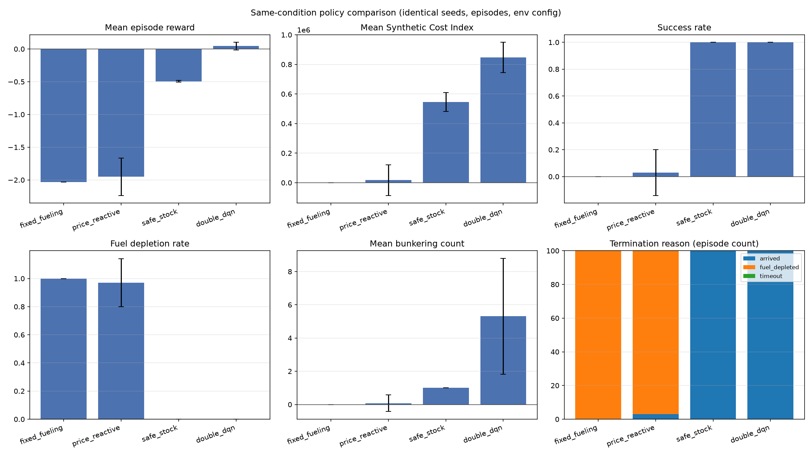
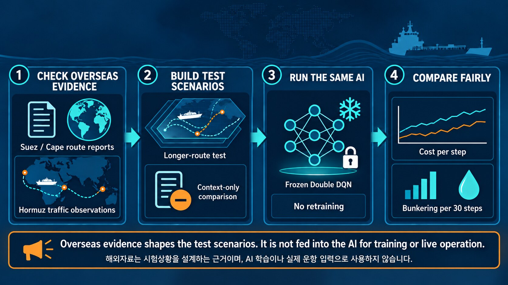
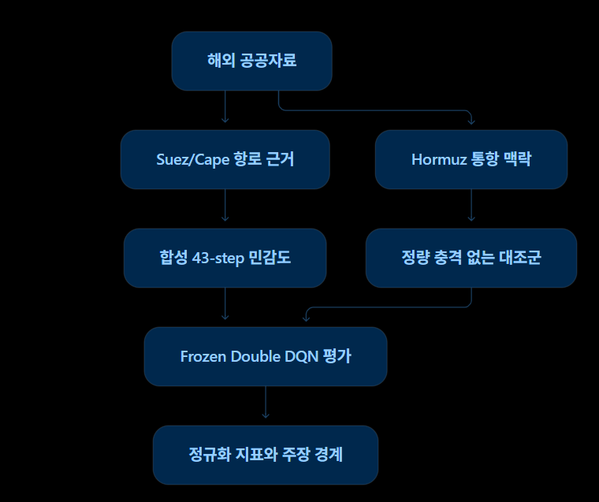

# 병커시유 | Bunkering-AI

선박의 가격·환율·연료잔량·잔여항로를 바탕으로 급유 의사결정을 실험하는 프로젝트입니다.
합성 항해 환경에서 규칙 기반 정책 3종과 Double DQN을 같은 조건으로 비교하고,
구매·소비·최종잔량과 결과의 근거를 함께 확인합니다.

[웹 시연](https://bunkering-ocean-lab.hc24734503.chatgpt.site/) ·
[빠른 시작](#빠른-시작) ·
[평가 결과](#평가-결과) ·
[자료 위치](#자료-위치와-최신본) ·
[진행 상태](docs/PROJECT_STATUS.md)


검증 배지는 2026-10-07 main `ee817ce`에서 Codex가 직접 실행한 **327 passed · 23 subtests passed** 기록입니다. 연구 코드 검사는 34개 통과했습니다([실행 기록: PR #104](https://github.com/heechan9/bunkering-ai/pull/104)). 이번 README 갱신은 새 테스트 실행이 아닙니다. 이전 Windows **288 passed** 및 공식 400행 재현·근거 감사 8/8은 [기존 검사 기록](docs/audits/local_verification_20261007.md)에 보존합니다.
이현수의 2026-09-27 독립 검증(245 passed)은 [PR #66](https://github.com/heechan9/bunkering-ai/pull/66)에 보존합니다. 근거 감사 배지는 공식 결과의 주장 8개 검사이며 실선 성능 검증을 뜻하지 않습니다.


## 지금 어디까지 완료됐나

2026-10-07 14:07 KST 상태 확인 기준입니다. PR #100–#103의 연구 코드·평가 보완 병합과 [Sites 36판 운영 검증](docs/audits/ocean_lab_live_verification_20261007.md)을 반영했습니다. **논문은 제출했지만 프로젝트의 실선 검증·데이터 확보·기능 개선은 진행 중입니다.**
아래 상태는 각 항목의 확인 범위이며 전체 프로젝트의 검증 완료를 뜻하지 않습니다.

| 연구·개발 단계 | 상태 | 확인된 범위와 남은 일 |
|---|---|---|
| 논문 제출 | ✅ 제출 확인 | 사용자가 10월 1일 제출 확인. 채택·심사 통과와 구분. [제출 기록](docs/submission/submission_status.md) |
| 규칙 3종·Double DQN 비교 | ✅ 합성 환경 평가 완료 | 동일 조건 비교 및 공식 결과 보관. 실선 성능 검증은 아님. [평가계약](docs/technical/evaluation_contract.md) |
| 4시드 재현·연료수지 진단 | ✅ 기록 대조 완료 | 구매·소비·최종잔량·보상 대조. DQN의 높은 보상을 비용 절감으로 해석하지 않음. [독립 대조](docs/technical/reward_diagnostics_results_4seed.md) |
| 급유 전 부족·예비연료·잔량가치 | ✅ 기존 항차 감사 완료 | 공식 기록의 추가 회계·안전 검사. 새 환경 재학습과 구분. [안전·비용 기준](docs/technical/safety_accounting.md) |
| 웹 결과·원문 일치 검사 | ✅ 근거 검사 구현 | 요약 70개 값·19,030개 전이 검사와 변조 검사. [검사 범위](docs/technical/web_evidence_guard.md) |
| Ocean Lab 지도·항차 재생 | ✅ 운영 확인 / 🛠 개선 중 | 기존 Sites 36판에서 PR #99 CSV 숫자 수정, 입력 오류 후 복구, 공유 상태 복원, CSV·GLB 다운로드 확인. 360/390/412px는 로딩 후 정상이며 초기 2~4px 넘침 기록. 실제 휴대폰·iOS Safari·다른 브라우저는 미검증. [운영 검사](docs/audits/ocean_lab_live_verification_20261007.md) |
| ONS·FuelCast 외부 평가 | ✅ 연구용 연결 | ONS는 통항·우회 맥락, FuelCast는 정규화한 소비 변동. 실제 선박 단위 보정은 미완료. [결정 기록](research/external_validation/DECISIONS.md) |
| FuelCast 재학습 모델 교체 | ⏸ 보류 | 비교에서 보정 비용 개선 근거 부족. 기존 공식 DQN 유지. [결정 기록](research/external_validation/DECISIONS.md) |
| 추가 안전재고 정책 | ✅ 연구용 비교 완료 | AdaptiveStock·최소 예비연료 기준선 비교. 공식 모델 교체와 구분. [결정 기록](research/external_validation/DECISIONS.md) |
| EIA·Brest·한바다호 | ⏸ 운영·학습 편입 보류 | 지연 가정·항차 연결·밀도와 시간 정합성 해결 필요. [자료별 판단](research/external_validation/DECISIONS.md) |
| Strathclyde·UCL | 📚 참고 범위 확정 | 민감도 사례·문헌 참고. 직접 운영 모델 연결은 아님. [자료별 판단](research/external_validation/DECISIONS.md) |
| Dockflow·일본 OCTARVIA | ⏳ 데이터 확보 대기 | 실항차 샘플·접근 조건 확보 필요. [자료별 판단](research/external_validation/DECISIONS.md) |
| 공개 문서 근거 검색 | 🛠 로컬 구현 | 원문·행 번호·파일 해시 반환. 웹 챗봇·생성형 답변 기능은 아님. [사용법](docs/technical/evidence_search.md) |
| UPA 신청·배정 공개 CSV | ✅ 원본 검산 완료 | 신청 6,028행·배정 10,099행. 중복·날짜 역전 확인. 벙커량 단위·실공급량 여부는 미확인. [검산과 한계](docs/data/upa_followup_20261005.md) |
| EMSA THETIS-MRV | ✅ 원본 확보·참고 통계 | 2024·2025 고정 버전 확보. 연간 소비 참고용이며 10분 소비 모델·급유 사건 검증에 직접 사용 불가. [적용 판정](research/emsa_mrv/README.md) |
| 영국 급유·프랑스 항로 연구 | ✅ 별도 합성 실험 완료 | 지연·가격·소비 불확실성과 경로 탐색 비교. 원 논문 전체 재현·실선 적용은 아님. [영국](research/uk_bunkering/README.md) · [프랑스](research/french_routing/README.md) |
| DataBio 소비·프랑스 참고 출력 모델 | ✅ 학습·조건별 진단 / ⏸ 교체 보류 | 8개 후보 모두 검증 MAE 기반 교체 기준 미통과. 선박 1 출력의 테스트 개선만으로 채택하지 않음. [판정](research/fuel_source_review/results/condition_diagnostics/판정.md) |
| NTNU 급유정책 이식 | ✅ 동결 모델 비교 / ⏸ 운영 적용 보류 | 1,800개 구성 조건·7전략 평가. 추진효율 미확정, 입력 스케일·전이 차이 확인. [공개 결과](research/ntnu_bunkering/README.md) |
| NTNU 별도 DQN 재학습 | ✅ 3시드 학습·산출물 검산 / ⏸ 교체 보류 | 3,052조건·18,312평가 행. 최소급유보다 비용이 낮은 조건은 있으나 저가항 규칙보다 우위 없음. 효율은 가정. [재학습 결과](research/ntnu_bunkering/RETRAINING.md) |
| UPA 인센티브 | ✅ 가정 비용 실험 완료 | 72조합 중 엄격한 비용 우위 전환 11개. 실제 요율·실제 절감액 평가가 아님. [실험](research/upa_incentive/README.md) |
| 미국 WSF·싱가포르 MPA | ✅ 집계 원본 검산 완료 | 선대 소비·헤지와 항만 판매량의 집계 참고. 개별 선박 ROB·실구매가와 구분. [WSF](research/wsf_review/README.md) · [MPA](research/public_bunker_review/README.md) |
| 울산세관 LNG 공급 사례 | ✅ 원문·합계 대조 / ⏳ 날짜 확인 대기 | 전 연료 월 공급 통계 95,604톤(소비·절감 근거 아님)과 그 안의 LNG 1,675톤(세관 기재 선박별 사례 2건)을 구분. ATLANTIC TOPAZ 공급일이 세관·UPA 간 불일치. [대조 결과](research/public_bunker_review/results/ulsan_customs_202608_review.md) |
| 시간 제약 계획기·공정 비교 하네스 | ✅ main 반영 | #100–#103 병합. 입력·수치 경계 검증, 동일 관측 계획기, 판정 임계값과 평가 집합 이력 정리. [공정 비교](research/fair_replacement_eval/README.md) |
| 공식 DQN 동일 관측 비교 | ✅ 실행 완료 / 🔎 Draft 검토 중 | 공식 모델·새 1,000건으로 합성 기준 통과. 비용 절감 우위는 미입증, 운영 DQN 유지. [PR #104](https://github.com/heechan9/bunkering-ai/pull/104) |
| 평가 사전 검증 보강 | 🔎 Draft·통합 검증 보고 | 메타데이터·환경·시드 검사 및 워커 시작 전 차단. Claude 통합 실행 90개 연구 / 전체 373개 통과(23 subtests). main 미반영. [PR #105](https://github.com/heechan9/bunkering-ai/pull/105) |
| 실제 선박 적용 | ⏳ 추가 기록 확보·독립 평가 필요 | 같은 선박·기간의 공급량·ROB·소비·가격 연결 미완료. 실제 비용·연료 절감률은 미입증 |

비공개 원자료·최종 제출 파일은 Google Drive에서 관리합니다. 상세 날짜별 이력은 [진행 기록](docs/PROJECT_STATUS.md)을 확인하세요.

## 주요 기능

- **정책 비교:** 고정 급유·가격 반응형·안전재고·Double DQN을 동일 seed·평가 횟수·환경설정으로 평가합니다.
- **결과 추적:** 구매량·소비량·잔량·급유 행동 횟수·합성비용과 원본 CSV·체크포인트 해시를 연결합니다.
- **Ocean Lab:** 한·영 전환, 7개 지역 지도, 항차 기록 재생·초기화, 구매안 비교와 자료 출처 확인을 제공합니다.
- **항차 자료 검토:** CSV 입력·연료수지·자료 변경 비교와 한바다호 AB-LOG 집계 검토를 지원합니다.

지도·선박 모형은 설명용입니다. 지역 선택은 평가 조건을 바꾸지 않으며, 실제 항적이나 선박 물리 시뮬레이션을 의미하지 않습니다.

## 한눈에 보는 작동 방식

<div align="center">


</div>

1. **현재 상황을 확인합니다.** 유가·환율·연료잔량·잔여항로·연료소비율 등 시장과 항해 상태를 입력으로 사용합니다.
2. **급유 전략을 비교합니다.** 세 가지 규칙 기반 정책과 Double DQN이 같은 가상 항해 조건에서 급유 여부와 행동을 결정합니다.
3. **항해 결과를 함께 평가합니다.** 목적지 도착, 연료고갈, 보상, 급유횟수와 합성비용을 기록해 안전성과 비용의 장단점을 확인합니다.

> 이 그림은 시스템의 개념적 흐름을 설명하기 위한 시각화입니다. 실제 선박을 자동 제어하거나 실시간 항만 운영시스템과 연동한 화면이 아닙니다.

## 연구 질문과 검증 설계

이 저장소는 다음 세 질문에 답하도록 구성했습니다.

1. **목적지에 도달하고 연료고갈을 피하는가?** 도착률과 연료고갈률로 확인하고, 안전선 미달과는 구분합니다.
2. **같은 조건에서 정책별 차이가 재현되는가?** 동일 seed·episode·환경설정과 공통 출력 형식을 적용합니다.
3. **높은 보상이 곧 운영상 우수함을 뜻하는가?** 급유횟수와 Synthetic Cost Index를 함께 보고 상충관계를 해석합니다.

병커시유는 선박의 순차 급유 의사결정을 실험하기 위한 강화학습 프로젝트입니다. 합성 항해 환경에서 가격·환율과 운항 상태를 함께 관측하고, 규칙 기반 정책과 학습 정책을 재현 가능한 조건으로 평가합니다.

- **실험 환경**: 선박 상태와 시장 조건을 재현한 Gymnasium 기반 `BunkeringEnv`
- **비교 정책**: 고정 급유, 가격 반응형, 안전재고, Double DQN 학습 정책
- **공정한 비교**: 동일한 난수 조건(seed)·평가 횟수(episode)·환경설정과 공통 결과 형식
- **근거 관리**: 공식 CSV·JSON, 체크포인트 해시, 논문 근거감사
- **현장 참고자료**: 울산항만공사 벙커링정박지 신청현황 6,028건


```mermaid
flowchart LR
    A["시장·항해 상태"] --> B["BunkeringEnv"]
    B --> C["Rule-based 3종"]
    B --> D["Double DQN"]
    C --> E["공통 평가계약"]
    D --> E
    E --> F["CSV · 그래프 · 근거감사"]
```

## 검증한 내용과 근거

| 문제와 판단 | 수행 내용 | 확인 가능한 근거 | 실무 연결 |
|---|---|---|---|
| 강화학습 정책만 제시하면 우수성을 공정하게 판단하기 어렵다고 정의 | 규칙 기반 3종과 Double DQN에 동일 seed·episode·환경설정을 적용 | 공통 평가계약, 공식 CSV·JSON, 체크포인트 해시 | 알고리즘 비교평가·재현 가능한 실험 설계 |
| 높은 보상만으로 운영상 우수하다고 결론 내리지 않음 | 성공률·연료고갈률·급유횟수·합성비용을 함께 비교 | 100회 가상 항해 공식 평가, 근거감사 8/8 | 안전·비용·성능의 다목적 의사결정 |
| 실험 데이터와 현장 참고자료의 역할을 구분 | 공공데이터는 업무변수 이해에 사용하고 DQN 성능 근거에서는 제외 | 데이터 설명서·해시·분석 스크립트 | 데이터 거버넌스·주장 범위 관리 |

> **최희찬의 역할:** 프로젝트 리드로서 문제와 요구사항, State·Action·Reward 및 KPI 방향, 실험 우선순위를 정하고 결과 검토·문서 통합·저장소 운영을 담당했습니다. 구현·검증의 세부 기여는 [기여 정책](CONTRIBUTIONS.md)에 구분해 기록합니다.

## 빠른 시작

### Python 환경

Python 3.11 환경에서 저장소 루트 기준으로 실행합니다.

```bash
git clone https://github.com/heechan9/bunkering-ai.git
cd bunkering-ai
python -m pip install -r requirements.txt
```

가상환경 생성·활성화는 사용하는 Conda 또는 venv 환경에 맞춰 진행합니다.

### 공식 결과 재현 — 재학습 불필요

[공식 Release](https://github.com/heechan9/bunkering-ai/releases/tag/official-eval-2026-09-01)에서
`dqn_final.pt`를 내려받아 `checkpoints/dqn_final.pt`로 저장합니다.
`checkpoints` 폴더가 없으면 먼저 생성합니다. 다운로드·해시 대조의
[Bash 및 PowerShell 예시](docs/technical/official_evaluation.md)를 참고하세요.

공식 파일 SHA-256:

```text
970aafbf2d32e9bef558a5611a300cd0885f826af2c872a83119a6e9fcbcf392
```

```bash
python scripts/evaluate.py --episodes 100 --seed 42 --checkpoint checkpoints/dqn_final.pt --output-dir results/local_reproduction
```

결과는 `results/local_reproduction/`의 `evaluation_results.csv`,
`evaluation_manifest.json`, `evaluation/summary.csv` 등에 생성됩니다.
저장소의 공식 결과와 별도 경로에 기록합니다.
재학습은 동일 가중치를 보장하지 않으므로 공식 수치 대조에는 배포 체크포인트를 사용합니다.

### 검사와 추가 실험

```bash
# 현재 저장소의 테스트 및 공식 근거 검사
python -m pytest -q
python -m scripts.audit_paper_evidence
```

근거 감사는 저장소의 공식 결과를 대상으로 합니다. 위 별도 재현 폴더를 자동 검사하는 명령은 아닙니다.
새 학습·기준선·항로 스트레스·소비량 민감도 실행은
[공식 평가](docs/technical/official_evaluation.md),
[Route-stress](docs/technical/route_stress_minimum_slice.md),
[V1.5 평가](docs/technical/v1_5_robustness.md)를 따릅니다.

### 웹 로컬 실행

Node.js·pnpm 요구 버전은 [웹 README](web/README.md)를 확인합니다.

```bash
cd web/ocean-lab
pnpm install --frozen-lockfile
pnpm dev
```

출력된 로컬 주소를 엽니다. 프로덕션 빌드는 `pnpm build`입니다.
GitHub 반영과 웹 배포는 별개이며 GitHub push만으로 자동 배포되지 않습니다.

## 평가 결과

### 공식 모델과 동일 관측 계획기의 후속 비교 — 2026-10-07

[PR #104](https://github.com/heechan9/bunkering-ai/pull/104)의 연구 평가에서 공식 Release 체크포인트를 재학습 없이 사용하고, 같은 관측만 받는 `planner_ops`와 비교했습니다. 대리 평가에 사용한 40M 시드를 이력에 남기고, A3에서 지정한 **50,000,000–50,000,999의 1,000건**으로 실행했습니다. 결과는 Draft 검토 중이며 아래 기존 공식 100항차 결과를 대체하지 않습니다.

| 항목 | 이번 공식 모델 비교 결과 | 해석 |
|---|---|---|
| 안전 도착 | 계획기 1,000/1,000 · DQN 999/1,000 | 차이 +0.1%p, 95% 구간 [0, +0.3]%p; 일반적 안전 우월성으로 확대하지 않음 |
| 재고 보정 SCI | 계획기 상대 차이 −0.0038%, 95% 구간 [−0.0786%, +0.0690%] | 공통 안전 999건; 비용 비열등 기준 충족, 유의한 절감 우위 없음 |
| 합성 마감 728/736/760h | 계획기 100/100/100% · DQN 0/0.4/68.6% | 24h 항해·8h 정차 가정 및 최소 기항 타이브레이크 영향; DQN은 마감을 관측하지 않음 |
| 결정당 p99 실행시간 | 계획기 1.5221ms · DQN 0.09943ms | 계획기가 더 느리지만 평가 장비에서 50ms 기준 충족 |
| 소비량 ±10% | 안전 비열등 기준 충족 | 합성 소비량 민감도이며 실측 변동 검증과 구분 |

자동 판정은 `REPLACEMENT_EVIDENCE_SUFFICIENT`로 G1–G5·R1–R5를 통과했습니다. **정해진 합성 연구 조건의 충족을 뜻하며, 운영 모델 교체·배포 승인이나 실선 비용 절감의 증거가 아닙니다. 운영 DQN은 유지합니다.** 사용이 끝난 50M 집합은 후보 튜닝 후 새 독립 확인 집합으로 재사용하지 않습니다.

[고정된 평가 보고서](https://github.com/heechan9/bunkering-ai/blob/2a73a05e9a7d79fc5e742f99b7c3897059a65b24/research/fair_replacement_eval/OFFICIAL_EVALUATION_20261007.md) · [집계 결과](https://github.com/heechan9/bunkering-ai/blob/2a73a05e9a7d79fc5e742f99b7c3897059a65b24/research/fair_replacement_eval/results/official_20261007_a3/summary.json)

후속 [PR #105](https://github.com/heechan9/bunkering-ai/pull/105)는 학습 메타데이터 누락·환경 불일치·시드 중복을 평가 시작 전에 검사합니다. Claude는 #104 `2a73a05`와 #105 `9667d27`의 임시 통합에서 연구 90개·전체 373개(23 subtests) 통과를 [보고](https://github.com/heechan9/bunkering-ai/pull/105#issuecomment-6030595776)했습니다. 이는 Claude 실행값이며 Codex의 독립 재실행이나 CI 통과를 뜻하지 않습니다. 두 PR은 현재 Draft이며 Jules 후속 감사·정정 검토가 진행 중입니다.

### 공식 단일 체크포인트 비교

Rule-based 3종과 Double DQN의 **공식 동일조건 성능비교를 수행했으며**,
정본은 [원본 CSV](results/evaluation_results.csv)와
[평가 manifest](results/evaluation_manifest.json)입니다.
학습 seed 42의 모델 하나를 평가 seed 42~141의 100개 합성 항차에서 비교했습니다.

| 정책 | 평균 Reward | Synthetic Cost Index | 성공률 | 연료고갈률 | 평균 급유횟수 |
|---|---:|---:|---:|---:|---:|
| Fixed Fueling (고정 급유) | -2.030 | 0 | 0% | 100% | 0.00 |
| Price Reactive (가격 반응형) | -1.952 | 17,370 | 3% | 97% | 0.08 |
| Safe Stock (안전재고) | -0.493 | 545,393 | 100% | 0% | 1.00 |
| Double DQN (학습 정책) | 0.044 | 847,118 | 100% | 0% | 5.31 |


Double DQN은 평균 보상이 가장 높았지만 Safe Stock보다 SCI와 급유 행동 횟수도 높았습니다.
낮은 SCI만으로 실패 정책을 우수하다고 평가하지 않으며, 도착 여부·연료 부족·잔량을 함께 봅니다.
[공식 평가 상세](docs/technical/official_evaluation.md)



Suez/Cape 대표 우회 가정에 대한 별도 route-stress 민감도 평가도 제공합니다.
Hormuz 자료는 정량 충격을 적용하지 않는 맥락적 대조군이며 독립 성능 시나리오로
세지 않습니다. 공개 Release의 frozen Double DQN 체크포인트를 재학습 없이 평가하고,
누적값과 함께 step 정규화 지표를 제시합니다. 43-step 조건은 실제 운항 검증이나
일반화 성능 주장이 아닌 합성환경의 탐색적 시나리오입니다
([문서](docs/technical/route_stress_minimum_slice.md)).
항로별 속도·기상·해류·연료소비 변화는 반영하지 않았으며, step 정규화 값을
실측 해리당 또는 운항일당 지표로 해석하지 않습니다.

<div align="center">



<br>



</div>

> 위 항로 스트레스 평가에서는 해외자료를 시험상황 설계에 사용하고 공식 DQN을 재학습하지 않습니다. 아래 별도 연구에는 외부자료를 사용한 소비·출력 후보 학습도 포함되며, 공식 모델 교체나 실제 운항 연결과는 구분합니다.

### 외부자료 검증과 추가 안전재고 기준선

FuelCast 소비 변동, ONS 항로 맥락, 가격·선체 저항 가정과 추가 안전재고 전략을
**별도 연구 환경**에서 비교했습니다. 공식 DQN과 위 공식 수치는 유지합니다.
FuelCast 추가 학습과 최소 예비연료 전략에서 공식 모델을 교체할 비용 개선 근거는
확보하지 못했습니다. 결과는 실선 검증이나 실제 비용 절감으로 해석하지 않습니다.

[최종 채택·보류 결정](research/external_validation/DECISIONS.md) ·
[코드·입력·재현 순서](research/external_validation/README.md) ·
[후속 연구 서술 초안](docs/technical/external_validation_writeup.md)

### 후속 연구에서 채택·보류한 내용

| 연구 | 확인한 결과 | 현재 결정 |
|---|---|---|
| [영국 급유 연구](research/uk_bunkering/README.md) | 9,600개 합성 사례에서 시간 대응·가격·소비 불확실성 비교 | 지각·비용·예비연료의 상충관계 진단에 사용 |
| [프랑스 항로 탐색](research/french_routing/README.md) | 90개 비교 행, 두 악천후 가정에서 경로 주변 탐색의 합성 비용 감소 | 연구용 비교 모듈로 보존; 실제 연료 절감률로 인용하지 않음 |
| [소비·출력 후보 감사](research/fuel_source_review/results/condition_diagnostics/판정.md) | 선박 1 출력 테스트 MAE 5.12~8.01% 개선, 학습 조건 내 검증에서는 7.99~15.39% 악화 | 8개 후보 모두 교체 기준 미통과; 공식 모델 유지 |
| [NTNU 이식 진단](research/ntnu_bunkering/README.md) | 공통 안전·시간 충족 1,624조건에서 동결 DQN 조정비용이 다음 구간 규칙보다 2.85%, LP보다 3.25% 높음 | 단위·효율·입력·전이 차이를 먼저 해결; 공개 결과는 재학습 실험이 아님 |
| [UPA 인센티브 민감도](research/upa_incentive/README.md) | 72개 가정 조합, 동률 포함 선택 변화 19개·엄격한 우위 전환 11개 | 승인 조건과 부대비용을 고려하는 연구 근거; 운영 비용 절감 실적은 아님 |

[외부 소비·출력 상세](docs/technical/external_fuel_power_status_20261005.md)에는 한바다호 일별 진단과 호주 항만 집계 연결 가정도 기록했습니다. 다른 선박의 출력 kW, 소비 L/h, 한바다호 kL 및 항만 집계는 동일한 실측 시계열로 합치지 않습니다.

### 네 개 독립 학습 seed에서 확인한 안정성

공식 단일 체크포인트 결과는 그대로 유지하면서, 학습 seed
`42·1042·2042·3042`에서 각각 5,000 episode를 학습한 네 개 Double DQN을
동일한 100-case 평가계약으로 추가 검증했습니다.

| 항목 | Normal | Suez/Cape 대표 조건 | 페어드 변화 |
|---|---:|---:|---:|
| 성공률 | 100% | 100% | 0%p |
| 연료고갈률 | 0% | 0% | 0%p |
| SCI/step | 27,992.11 | 29,418.37 | +5.10% |
| 급유횟수/30-step | 4.900 | 5.587 | +13.97% |

네 체크포인트 모두 같은 변화 방향을 보였습니다. 이는 현재 합성환경과
공유 평가 seed 안에서의 학습 안정성 근거이며 실제 항차 성능·비용절감이나
Double DQN의 보편적 우월성을 뜻하지 않습니다
([4-seed 결과 스냅샷](docs/technical/multiseed_results_4seed.md)).

V1.5에서는 같은 네 frozen 체크포인트에 정규화 소비량 충격과
42/43/44-step 민감도를 적용했습니다. 소비량 +10%와 +20%에서 DQN은 모두
성공률 100%·연료고갈률 0%를 유지했지만 SCI/step은 각각 평균 +11.68%,
+22.59% 증가했습니다. 43-step 대비 42/44-step의 SCI/step 변화는
-0.48%와 +0.30%로 작았습니다. 이는 합성환경 강건성 결과이며 실제 연료량,
항해거리 또는 비용절감의 증거가 아닙니다
([V1.5 4-seed 결과](docs/technical/v1_5_results_4seed.md)).

### 네 개 학습 체크포인트의 연료수지 진단

학습 seed 42·1042·2042·3042의 기본조건 결과입니다.
위 단일 체크포인트 표와 구분해서 사용합니다.

| 항차 평균 | Safe Stock | DQN 4개 체크포인트 평균 |
|---|---:|---:|
| 도착률 | 100% | 100% |
| 총급유량 | 0.85000 | 1.31325 |
| 소비량 | 1.50000 | 1.50000 |
| 최종잔량 | 0.35000 | 0.81325 |
| SCI | 545,392.72 | 839,763.41 |
| 급유횟수 | 1.00 | 4.90 |


연료량은 정규화 단위입니다. DQN의 추가 구매량은 추가 최종잔량과 일치하며 SCI는 53.97% 높았습니다.
기본조건 Safe Stock의 기존 안전선 위반 판정에는 부동소수점 경계 효과가 확인됐습니다.
허용오차를 적용한 후처리 재분류와 환경 수정·재평가는 서로 다릅니다.
[진단 결과](docs/technical/reward_diagnostics_results_4seed.md) ·
[결과표](results/diagnostics/review_4seed/policy_accounting_comparison.csv) ·
[원본 출처·해시](results/diagnostics/review_4seed/provenance.json)

결과를 읽을 때 다음을 구분합니다.

- **목적지 도착과 안전여유 확보:** 도착률만으로 항해 전 과정의 안전잔량 확보를 판단하지 않습니다.
- **급유 행동과 기항:** 표의 급유횟수는 환경 내 행동 집계이며 실제 기항 횟수가 아닙니다.
- **SCI와 실화폐 비용:** Synthetic Cost Index는 합성환경 내부 지표로 실제 USD/KRW 비용이나 비용절감 실적이 아닙니다.
- **단일 모델과 4-seed 확장:** 서로 다른 평가 묶음이며 수치를 섞어 인용하지 않습니다.

추가 실험은 [4-seed 결과](docs/technical/multiseed_results_4seed.md),
[V1.5 소비량·horizon 민감도](docs/technical/v1_5_results_4seed.md),
[규칙 정책 강건성](docs/technical/rulebased_robustness.md)에 분리해 보존합니다.

## 자료 위치와 최신본

| 자료 | 기준 위치 | 사용 안내 |
|---|---|---|
| 코드·실행 방법 | 이 저장소와 [웹 README](web/README.md) | 현재 구현은 main, 재현 시에는 사용한 커밋을 함께 기록 |
| 공개 실험 결과 | [results](results/), [평가 manifest](results/evaluation_manifest.json) | 조건·체크포인트·원본 해시와 함께 확인 |
| 공개 체크포인트 | [GitHub Release](https://github.com/heechan9/bunkering-ai/releases/tag/official-eval-2026-09-01) | 공식 단일 모델. 4-seed 체크포인트 전체 보관을 뜻하지 않음 |
| 원본 데이터·논문·인수인계 | [병커시유 Drive](https://drive.google.com/drive/folders/1g5uRRYEoS69lhMiuRyHNi_u1lwkd33Bx) | 비공개 보관함. 허가된 계정만 열 수 있음 |
| 자료별 위치·최신본 목록 | [Drive 자료 목록](https://drive.google.com/file/d/1H42yNhpf0Ho0kJyZsCt7b7sdUn3UMzfb/view) | 파일 링크·최종본 식별·중복 확인·미확보 항목 |
| 논문 공개 안내 | [제출 상태](docs/submission/submission_status.md) | 최종 Word 식별 기록. 최종본 전문은 공개하지 않음 |

Drive는 `01_원본데이터`, `02_실험결과`, `03_프로젝트논문`,
`04_참고논문`, `05_인수인계`, `06_학습모델_및_재현`으로 구분했습니다.
최종 논문은 `03_프로젝트논문`의 버전 번호 없는 Word이며,
이전 원고는 같은 폴더의 `이전원고_수정이력`에 보관합니다.
업로드 날짜만으로 최신본을 판단하지 않습니다.

기존 자료는 삭제하지 않았고 동일 파일은 해시를 대조해 중복 업로드를 줄였습니다.
코드와 공개 결과는 GitHub에 유지하고 Drive 목록에서 연결합니다.
원본 AB-LOG와 실명·이메일이 포함된 최종 논문은 공개 저장소에 추가하지 않습니다.
과거 Git 기록에는 개인정보가 남아 있을 수 있습니다.


### 학습 모델·재현 자료 바로가기

| 자료 | 보관 위치 | 구분 |
|---|---|---|
| 기존 4-seed 모델·원본 평가 | [Drive 보관 폴더](https://drive.google.com/drive/folders/1dNGPH5qu2QoWmC66-crlLtSHpJ_tbnxP) | 모델·원본 평가 백업과 독립 재실행 검증 ZIP. [공개 출처·해시](results/diagnostics/review_4seed/provenance.json)와 함께 확인 |
| 소비·출력 후보 모델, 항만 대기 연구, 공개자료 연결 검토 | [학습모델 및 재현](https://drive.google.com/drive/folders/1rnSBEGCh9byHomAAuu2N4XGiI4lY1pDT) | 하위 폴더별 연구 자료. 공식 DQN 교체·운영 채택 여부는 각 결과의 판정을 따름 |

공식 단일 모델은 위 Release에서 받습니다. Drive ZIP의 원본 평가와 재실행 결과는 서로 다른 기록이므로 원본을 덮어쓰지 않습니다.

## 현장 참고자료

- **울산항만공사 벙커링정박지 신청현황:** 6,028건의 업무변수·분포를 검토했습니다.
  공공데이터를 DQN 학습 입력이나 공식 성능평가 데이터로 사용하지 않았으며,
  실시간 API 연동도 구현하지 않았습니다.
  [출처·해시](docs/data/upa_bunkering_anchorage.md) ·
  [검토 기록](docs/data/upa_review_20260919.md) · [분석 결과](results/public_data/)
- **한바다호 AB-LOG:** 2026년 5월 기록의 요약표 M/T·일별표 kL를 구분하고
  날짜 범위 3개 × 가정 밀도 5개의 산술 민감도를 계산했습니다.
  ROB 차감값의 일치는 독립 소비량 계측 검증이 아니며 밀도·기준 조건·시간 정합성은 미확인입니다.
  [검토 기능](docs/technical/hanbada_ab_log_design_20260922.md) ·
  [집계 비교·15개 가정 시나리오](docs/technical/hanbada_comparison_experiment.md)

| 확인 항목 | 저장소 근거 |
|---|---|
| 원자료·출처·해시 | [데이터 설명서](docs/data/upa_bunkering_anchorage.md) |
| 재현 가능한 분석 | [분석 스크립트](scripts/analyze_upa_public_data.py) |
| 기초통계·품질검사 | [공공데이터 결과](results/public_data/) |
| 보고서 반영 범위 | [보고서 업데이트 가이드](docs/submission/public_data_report_updates.md) |

## 다음 검증에 필요한 기록

- **울산항만공사:** 2026-10-05 공급일 차이, 비식별 공급확인서·작업기록, ROB·소비·가격 자료의 문의 창구를 요청했습니다. 회신 대기이며 자료 제공이 확정된 상태는 아닙니다.
- **한바다호:** 기존 AB-LOG와 연결되는 항해 직전·직후 급유 기록, 급유 전후 ROB·측정 시각, 소비량 산출 방식·밀도 기준이 필요합니다. 추가 요청문은 준비했으며 발송 확인 전입니다.
- **검증 조건:** 동일 선박·동일 기간·동일 연료의 기록을 연결한 뒤 연료수지와 가격·기한·공급 제약을 확인합니다. 관측 기록의 대조만으로 정책의 실제 절감 효과가 입증되지는 않습니다.

## 검증 기록과 남은 범위

| 기록 | 확인 범위 |
|---|---|
| [PR #66](https://github.com/heechan9/bunkering-ai/pull/66) | 2026-09-27 main `3b5f95b` 기준 245개 테스트 기록 |
| [최종 웹 검사](docs/audits/final_web_check_20261002.md) | 관련 Python 25개, 구매 비교·CSV·한영 검사와 소스 동기화 기록 |
| [운영 웹 확인](docs/audits/ocean_lab_live_verification_20261007.md) | Sites 36판의 실제 CSV·GLB 다운로드, 공유 상태 복원, 데스크톱 360/390/412px 검사 |
| [근거 감사](docs/technical/paper_evidence_audit.md) | 문서·코드·공식 산출물의 일관성 검사 |
| [보안 검토](docs/technical/security_review.md) | 당시 오프라인 정적 검토 범위와 미검증 항목 |

테스트 수는 해당 시점의 실행 기록이며 최신 main 전체 재검증 배지가 아닙니다.
2026-10-07 기존 Sites 36판에서 실제 파일 선택·CSV/GLB 다운로드·공유 링크 복원과 데스크톱 브라우저의 360/390/412px 배치를 확인했습니다. 지도 로딩 중에는 2~4px의 일시적 가로 넘침이 관측됐으며, 로딩 완료 후에는 없었습니다. 실제 휴대폰·iOS Safari 및 다른 브라우저의 사용 검증은 남아 있습니다.
실제 운항 비용절감, 항만별 가격·공급·대기 제약 및 외부 성능 검증도 완료되지 않았습니다.
[모델 경계와 연구 로드맵](docs/technical/model_boundary_and_research_roadmap.md)

## 저장소 구성

| 경로 | 역할 |
|---|---|
| `agents/` | Double DQN 에이전트와 신경망 |
| `envs/` | Gymnasium 기반 `BunkeringEnv` |
| `configs/` | 학습 하이퍼파라미터 |
| `evaluation/` | 공통 평가계약과 논문 근거감사 |
| `route_stress/` | 출처·가정이 분리된 항로 스트레스 시나리오 |
| `scripts/robustness/` | 공식 결과와 분리된 V1.5 소비량·horizon 민감도 및 집계 |
| `scripts/` | 기준선·학습·평가·데이터 분석 CLI |
| `data/public/` | 출처와 해시를 기록한 공공데이터 |
| `results/evaluation/` | 공식 동일조건 평가 요약과 시각화 |
| `research/time_constrained_planner/` | 시간 제약 급유 계획기의 별도 연구·경계 검증 |
| `research/fair_replacement_eval/` | 동일 관측 비교, 사전 판정 기준, 대리 평가 기록; 공식 후속 결과는 #104 검토 중 |
| `tests/` | 환경·에이전트·평가·데이터 검증 |
| `web/ocean-lab/` | Ocean Lab 웹 소스 |

## 문서 안내

| 문서 | 내용 |
|---|---|
| [상태·행동·보상 명세](docs/technical/state_action_reward_spec.md) | 환경 계약과 주장 경계 |
| [공통 평가계약](docs/technical/evaluation_contract.md) | 정책 간 공정 비교 기준 |
| [공식 평가](docs/technical/official_evaluation.md) | 실행 조건·산출물·체크포인트 검증 |
| [논문 근거감사](docs/technical/paper_evidence_audit.md) | 문서·코드·정본 근거 일관성 검사 |
| [Rule-based 강건성 검증](docs/technical/rulebased_robustness.md) | 공식 결과와 분리된 200-seed 독립 재현 |
| [Route-stress 최소 슬라이스](docs/technical/route_stress_minimum_slice.md) | 해외 항로 근거·대표 가정·frozen DQN 민감도 평가 |
| [다중 학습 seed 평가](docs/technical/multiseed_evaluation.md) | 독립 체크포인트 검증·페어드 효과·자동 보고서 생성 |
| [4-seed 결과 스냅샷](docs/technical/multiseed_results_4seed.md) | 네 체크포인트의 안정성·페어드 route-stress 효과·주장 경계 |
| [모델 경계와 연구 로드맵](docs/technical/model_boundary_and_research_roadmap.md) | V1 포함·제외 범위, 공정성 감사, V1.5~V5 연구계획 |
| [V1.5 강건성 평가](docs/technical/v1_5_robustness.md) | 연료소비 충격·42/43/44-step 민감도·tail-risk 계약 |
| [V1.5 4-seed 결과](docs/technical/v1_5_results_4seed.md) | 네 frozen 체크포인트의 소비량·horizon 민감도 결과와 주장 경계 |
| [정적 보안 검토](docs/technical/security_review.md) | 검토 범위·비검증 항목·CSV 및 웹/API 확장 체크리스트 |
| [운항 검증 로드맵](docs/technical/causal_operational_validation.md) | 합성환경과 실제 운항 효과의 구분 |
| [직무 연계 가이드](docs/ROLE_ALIGNMENT.md) | 구현 증거·직무 연결·주장 한계 |
| [기여 정책](CONTRIBUTIONS.md) | 사람·AI 협업 역할과 검증 원칙 |
| [항차 CSV 검토](docs/technical/voyage_intake.md) | 입력 필드·연료수지·변경 감지 |
| [팀 검토 절차](docs/technical/ax_evidence_communication.md) | 결과 설명과 근거 확인 |
| [해양 분야 검토](docs/technical/maritime_domain_review_20260920.md) | 팀 검토 의견과 채택 범위 |

과거 논문·검토·배포 이력은 [진행 상태 문서](docs/PROJECT_STATUS.md)와 각 상세 문서에 보존합니다.

