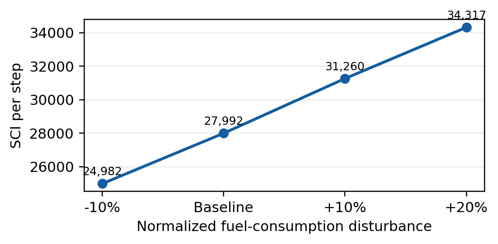

합성 항해환경에서 Double DQN 기반 벙커유 구매 의사결정의 강건성 및 연료수지 평가

최희찬¹, 이현수², 신민재³, 김승현³

¹한국공학대학교 전자공학부   ²한국공학대학교 게임공학과
³한국해양대학교 기관시스템공학부

E-mail: 4434503@naver.com

Robustness and Fuel Accounting Evaluation of Double DQN-Based Bunker Purchasing Decisions in a Synthetic Voyage Environment

Hee-Chan Choi¹, Hyun-Soo Lee², Min-Jae Shin³, Seung-Hyeon Kim³

¹Department of Electronic Engineering, Tech University of Korea
²Department of Game Engineering, Tech University of Korea
³Division of Marine System Engineering, Korea Maritime & Ocean University

## 요약

본 연구는 시장·운항 상태를 고려한 합성환경에서 규칙 기반 정책 3종과 Double DQN을 동일 조건으로 평가하였다. 공식 결과를 보존하면서 네 학습 체크포인트를 동일한 100개 사례에 각각 적용해 소비량·항로 길이 민감도와 연료수지를 분석하였다. 소비량 +20%에서 DQN의 도착률은 100%였으나 SCI/step은 22.59% 증가하였다. 기본조건 원본 진단에서 연료수지는 수치 오차 내 일치했으며, DQN은 Safe Stock보다 구매량·최종잔량과 SCI가 높았다. Safe Stock의 기존 안전선 미달 판정은 부동소수점 경계 오차에서 발생해 실질적인 안전성 열세의 근거로 해석하지 않았다. 본 결과는 합성환경의 정책 비교와 평가계약 진단이며 실제 비용절감이나 현장 성능 검증을 의미하지 않는다. 한바다호 AB-LOG는 단위·집계 범위와 15개 가정 시나리오를 비교하되 실측 정합성은 미확정으로 남겼다.

## 서론

국제해운에서 벙커유 구매는 가격 변동과 환율뿐 아니라 선박의 연료잔량과 남은 항로를 함께 고려해야 하는 순차 의사결정 문제이다. 기존 연구는 정기선 서비스의 선속과 벙커 구매량을 수리적으로 최적화해 왔으며[1], 강화학습은 변화하는 상태에서 반복적인 행동을 선택하는 대안이 될 수 있다. 그러나 평균 보상만을 비교하면 연료고갈, 비용 노출 및 급유 빈도의 상충관계를 놓칠 수 있다.

본 연구는 시장·운항 상태에 기반한 벙커링 의사결정 모델의 재현성과 강건성을 평가한다. 규칙 기반 정책과 Double DQN의 동일조건 비교, 복수 학습 seed, 항로 길이·정규화 소비량 민감도 및 tail-risk를 분석하고, 원본 행동 기록으로 구매·소비·잔량과 안전선 판정의 일관성을 진단한다. 본 연구의 질문은 높은 보상·도착률이 낮은 구매비용 및 적정 재고와 일치하는가이다. 비용·재고·보상의 불일치와 수치 경계 오류를 진단하고 실선 자료가 뒷받침하는 주장 범위를 구분한다.

## 연구 방법

BunkeringEnv는 유가, 유가 이동평균, 환율, 연료잔량, 남은 항로 및 sfc의 여섯 관측변수를 제공한다. sfc는 합성 상태 변수이며 실측 기관 연료소비율을 뜻하지 않는다. 행동은 급유 여부와 항만 선택을 나타내지만 항만별 가격·전이 차이는 구현하지 않았다. 비교정책은 Fixed Fueling, Price Reactive, Safe Stock과 Double DQN이다. Double DQN은 행동 선택과 목표값 평가를 분리한다[2]. 합성 구매비용 지표(SCI)는 시뮬레이션 실급유량(정규화)과 의사결정 시점 가격·환율의 곱을 항차별로 합산하며 최종 재고가치는 차감하지 않는다.

<표 1> 평가계약 및 강건성 시나리오

| 항목 | 설정 |
|---|---|
| 학습 seed | 42, 1042, 2042, 3042 |
| 학습량 | 각 5,000 episode |
| 평가 | 각 100 case, base seed 42 |
| 소비량 | 0.9, 1.0, 1.1, 1.2배 |
| horizon | 42, 43, 44 step |

같은 시나리오 내에서 정책별 초기조건·환경·평가 seed와 비용·보상 계산을 통일하고, 체크포인트를 고정한 greedy inference로 평가하였다. 규칙 반복을 독립 학습 표본으로 세지 않았으며 표준편차는 네 체크포인트의 기술통계(ddof=0)이다. 보충 진단은 기본 소비량 0.05와 30-step에서 수행했다. 초기잔량＋급유량−소비량−상한손실＝최종잔량을 확인하고, step 기록과 집계표를 독립 재계산하였다[3]. 표준편차는 신뢰구간이 아니며, 강건성은 고정 시장 사례의 소비량·기간 민감도로 한정한다. 새로운 시장 분포의 일반화를 의미하지 않는다.

## 실험 결과

동일한 Normal 평가에서 Fixed Fueling, Price Reactive와 Safe Stock의 목적지 도착률은 각각 0%, 3%, 100%였고 SCI 평균은 각각 0, 17,369.5, 545,392.7이었다. 네 Double DQN의 평균 보상은 0.0439, 성공률은 100%, 연료고갈률은 0%였으며, 평균 SCI는 839,763.41, SCI/step은 27,992.11, 급유횟수는 4.900회였다. 따라서 DQN의 높은 보상과 도착 안정성이 Safe Stock 대비 SCI 절감을 의미하지는 않았다. Suez/Cape 43-step 대표 조건에서는 SCI/step이 29,418.37로 평균 5.10% 증가하고, 30-step당 급유횟수는 5.587회로 13.97% 증가했다. 변화율은 각 체크포인트 내부의 paired 변화율을 계산한 뒤 평균하였다.

<표 2> Double DQN의 4-seed 강건성 결과

| 조건 | SCI/step 변화 | 급유 변화 |
|---|---|---|
| 소비 -10% | -10.75±0.24% | -6.45±0.76% |
| 소비 +10% | +11.68±0.87% | +5.88±0.70% |
| 소비 +20% | +22.59±0.55% | +10.56±1.72% |
| 42 vs 43 | -0.48±0.25% | -0.70±0.40% |
| 44 vs 43 | +0.30±0.30% | +0.64±0.27% |

(그림 1) 정규화 연료소비 교란에 따른 Double DQN SCI/step

표 2의 급유 변화는 30-step당 급유횟수의 변화율이며 ±는 네 체크포인트의 표준편차(ddof=0)이다. 시험한 소비량 조건에서 네 체크포인트 평균 SCI/step과 급유빈도는 소비량에 따라 단조 증가했으며, 도착률은 모두 100%였다. 또한 43-step 대비 42·44-step의 SCI/step 변화는 각각 -0.48%, +0.30%로 작아 검토한 정수 horizon 범위에서 SCI/step의 국소 민감도가 작았다.

네 체크포인트 Normal 로그의 tail 분석에서 체크포인트별 최소 reward의 평균은 -0.0171, 체크포인트별 하위 5개 episode의 reward 평균을 다시 평균한 값은 -0.0038이었다. 최대 SCI의 평균은 1,129,718, 체크포인트별 상위 5개 SCI 평균의 평균은 1,072,647이며, 최대 급유횟수는 평균 16.75회, 개별 최대 18회였다. 이는 평균값만으로는 일부 합성 episode의 높은 비용·행동 부담을 설명하기 어렵다는 점을 보여준다.

기본조건 진단은 규칙 반복을 포함한 1,600개 합성 항차·40,120개 step으로 구성된다. 중복 규칙을 제거하면 규칙 300개와 DQN 400개 평가 조합이며 동일한 100개 시장 seed를 공유한다. 항차 연료수지 최대 절대오차는 1.6×10⁻¹⁵였다. Safe Stock과 DQN의 평균 소비량은 모두 1.5였고, DQN의 추가 구매량 0.46325는 추가 최종잔량과 일치했다(표 3).

동일한 네 체크포인트를 Linux에서 재학습 없이 다시 실행했을 때, 기본조건 전이 CSV 4개는 Windows 원본과 파일 단위로 일치했다. 실행 전후 정책·타깃·optimizer 상태는 불변이었다. 이는 기본조건의 재현성 확인이며 소비량·horizon 스트레스 재실행을 의미하지 않는다[3].

<표 3> 기본조건의 구매 재고 및 안전선 판정

| 정책 | 안전선 미달률 원래/재분류 (%) | SCI (천 단위) | 급유량 | 최종잔량 |
|---|---|---|---|---|
| Fixed | 100/100 | 0.0 | 0.0000 | 0.0000 |
| Reactive | 99/98 | 17.4 | 0.0285 | 0.0135 |
| Safe Stock | 100/0 | 545.4 | 0.8500 | 0.3500 |
| DQN 평균 | 0/0 | 839.8 | 1.3133 | 0.8133 |

미달률은 안전선 위반 1회 이상 항차의 비율(%)이며 연료고갈률과 다르다. 재분류는 기존 기록에 잔량 < 0.15−10⁻¹²를 적용한 후처리다. 급유량·잔량은 정규화 단위이며 DQN은 네 체크포인트 평균이다. Fixed와 Reactive의 낮은 SCI에는 항차 실패가 포함된다.

Safe Stock은 17번째 전이에서 잔량 0.1499999999999997이 안전선 0.15보다 작다고 판정되어 매 항차 -0.5의 벌점을 받았다. 행동을 고정한 십진수 재생과 10⁻¹²~10⁻⁶ 허용오차 재분류에서는 전이 후 미달이 없었다. 이는 기존 기록의 민감도 분석이며 수정 환경의 새 평가가 아니다. DQN의 최저잔량은 약 0.30으로 더 큰 여유를 유지했으나 SCI는 53.97% 높았다.

DQN의 시뮬레이션 실급유 1,960회 중 529회(26.99%)는 한 step 소비량인 0.05 수준의 보충 급유였으며, 이때 가격우위 보상의 57.86%가 발생했다. 가격우위 보상은 구매량으로 가중되지 않는다. 반복 급유와 보상의 동시 관찰만으로 보상 설계의 인과효과를 확정할 수는 없다.

## 실선 기록의 집계 비교

해기교육원이 김승현을 통해 제공한 한바다호 AB-LOG[4]는 2026년 5월 자료이며 상단 날짜는 제출일이다. 요약 소비량 195.2 M/T는 ROB 670.3−475.1의 차감값이다. 그 일치와 기관별 합계의 일치는 산술 관계이며 독립 소비량 계측 검증이 아니다. 일별표(B FOAM)는 최초 M/T 안내에서 kL로 정정됐다. 무관하게 포함된 Sheet1은 제외하고 ×0.95를 환산계수로 사용하지 않았다.

담당자는 ROB가 통상 정오 기준이며 31일 접안 진행이 항해 기록을 설명할 수 있다고 회신했다. 초기 ROB는 5월 6일 15:54경, 종료는 항차 종료일 약 13시경이라는 추정이다. 확정 시각으로 취급하지 않고, 날짜 표기 행 3개 범위만 비교하였다(표 4). 빈 칸을 관측된 0으로 바꾸거나 부분일을 배분하지 않았다.

<표 4> 일별 소비량 집계와 총량 일치 비율

| 선택 행 | M/E | G/E | Boiler | 합계 kL | 195.2/V |
|---|---|---|---|---|---|
| 1~31일 | 123.4 | 79.4 | 26.1 | 228.9 | 0.852774 |
| 6~31일 | 123.4 | 79.4 | 23.4 | 226.2 | 0.862953 |
| 6~30일 | 107.3 | 76.3 | 22.9 | 206.5 | 0.945278 |

기관별 값의 단위는 kL, 마지막 열은 t/kL이며 총량을 맞추는 역산 비율이지 실측 밀도가 아니다. 같은 단위의 1~5일 합은 2.7 kL, 31일은 19.7 kL이다. 범위 3개×분석자가 정한 공통 밀도 0.800·0.825·0.850·0.875·0.900 t/kL의 15개 결정론적 시나리오를 계산했다[3]. 실측값·물성 적정 범위·신뢰구간이 아니며 기관·날짜별 동일 밀도와 무온도보정을 가정했다.

0.850 가정의 환산량은 순서대로 194.565·192.270·175.525 t이다. 첫 범위의 요약 대비 차이는 −0.635 t(−0.325%)이나 가까운 총량은 정확성 증거가 아니다. 기관별 요약 질량/전체 부피 비율도 0.754457·0.964736·0.977011 t/kL로 달라 단일 계수가 세 기관을 동시에 맞추지 못한다. 실제 밀도·기준 조건·집계 시간이 없어 실측 정합성과 오류 원인은 미확정이다. 원본 비공개 조건을 준수한다. 이 분석은 합성 실험의 외부 성능 검증이 아니라, 실선 자료를 정책 평가에 연결하기 전에 필요한 단위·시간·측정 독립성의 점검이다. 실제 구매량·가격이 없어 정책 성능이나 비용절감을 검증하지 않는다.

## 논의 및 한계

DQN은 시험한 조건에서 도착률과 연료고갈률을 유지했지만, 높은 보상이 낮은 SCI나 적은 급유를 의미하지 않았다. 특히 기본조건 Safe Stock의 미달 판정은 수치 경계 효과로, 이를 실질 안전성 열세로 해석하지 않는다. 기존 보상과 공식 수치는 보존하며 경계 비교 수정의 학습 영향은 별도 검증 과제로 남긴다. SCI는 잔존재고 가치를 차감하지 않으므로 53.97% 차이를 순경제손실로 단정할 수 없다. 반대로 높은 잔량만으로 추가 구매가 정당화되지 않으며 현재 결과는 DQN의 비용 우수성을 입증하지 않는다.

안전선 후처리는 학습 당시 벌점 영향을 제거하지 않는다. 수정 환경에서 같은 학습 예산과 평가 사례로 재학습하고, 최종재고 가치·급유 고정비를 반영한 지표와 보상 항별 제거 실험으로 원인을 검증해야 한다. 이 추가 실험은 아직 수행하지 않았다.

현재 모델은 실제 선속·기상·기관·추진효율·선종 및 탄소비용을 반영하지 않는다. Suez/Cape 조건은 horizon 확장으로 표현한 대표 시나리오이며 실제 항로·기상 재현은 아니다. 소비량 -10%에는 초기 상한 처리 손실 0.005가 포함되며 그 성능 영향은 분리 검증하지 않았다. 이번 안전선 재분류는 기본조건에 한정한다. SCI는 실제 통화비용이 아니며 실제 항차·에너지모델을 결합한 외부 검증이 필요하다[5]. 실제 항차의 AIS·기상·선속·기관부하·연료소비량을 결합한 실측 검증자료는 확보하지 못했으며, 공공자료의 도메인 참고와 정책의 현장 검증을 구분한다.

울산항만공사 벙커링정박지 신청현황 6,028건·8개 항목을 대조하였다[6]. 선박 식별자·소비량·출발 및 도착 잔량·가격이 없고, 벙커량의 단위와 신청량/실공급량 여부는 미확인이다. 입항년도와 입항항차 조합도 반복되어 항차 연결을 확정할 수 없다. 따라서 해당 자료는 업무 맥락 파악에 활용하며 실측 연료수지나 정책 성능 검증의 근거로 사용하지 않는다.

Ocean Lab 웹 시연은 연구의 가정과 정책 비교를 설명하는 시각화 도구이다. 화면상의 항로·선박 표현은 실제 선박 거동의 재현이나 현장 성능 검증의 근거가 아니며, 논문의 정량적 결론은 고정된 평가 로그와 진단 결과에 한정한다.

## 결론

본 연구는 동일조건 정책 비교, 복수 체크포인트 강건성 및 연료수지 진단을 제시하였다. DQN은 평가 범위에서 도착률 100%를 유지했으나 기본조건에서 Safe Stock보다 SCI와 최종잔량이 높았다. 안전선 경계 판정의 수치 효과를 분리함으로써 보상·SCI·잔량을 함께 해석할 필요성을 확인하였다. 이는 실제 비용절감의 증명이 아닌 후속 검증을 위한 합성 평가 기반이다[3]. 한바다호 집계 비교는 단위·시간·측정 독립성 점검이며 실제 급유정책의 외부 성능 검증이 아니다.

※ 본 논문은 해양수산부 스마트 해운물류 융합인재 및 기업지원(스마트해운물류×ICT멘토링)을 통해 수행한 ICT멘토링 프로젝트 결과물입니다.

## 참고문헌

[1] Z. Yao, S. H. Ng, and L. H. Lee, “A study on bunker fuel management for the shipping liner services,” Computers & Operations Research, vol. 39, no. 5, pp. 1160-1172, 2012, doi:10.1016/j.cor.2011.07.012.

[2] H. van Hasselt, A. Guez, and D. Silver, “Deep Reinforcement Learning with Double Q-learning,” Proceedings of the AAAI Conference on Artificial Intelligence, vol. 30, no. 1, 2016, doi:10.1609/aaai.v30i1.10295.

[3] H. C. Choi et al., “Bunkering-AI: reproducible synthetic bunkering decision evaluation,” GitHub repository, 2026. https://github.com/heechan9/bunkering-ai

[4] 한국해양대학교 해기교육원, 한바다호 AB-LOG, 2026년 5월, 미공개 자료 및 제공기관 후속 회신, 2026.

[5] D. Marijan, H. H. Mohammed, and B. Zaman, “Estimation and Optimization of Ship Fuel Consumption in Maritime: Review, Challenges and Future Directions,” Journal of Marine Science and Technology, vol. 31, pp. 54-76, 2026, doi:10.1007/s00773-025-01104-9.

[6] 울산항만공사, “벙커링정박지 신청현황_20240819,” 공공데이터포털, 데이터 ID 15132700. https://www.data.go.kr/data/15132700/fileData.do (확인: 2026.9.19).